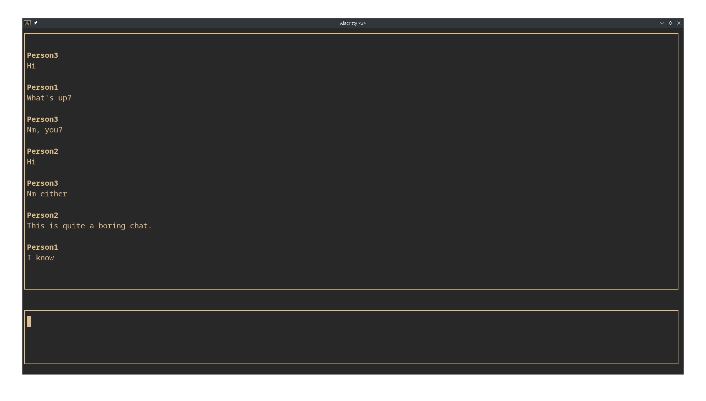

# Boring Chat

Boring Chat is a multi-threaded, TUI TCP client/server program for communication between Unix-like systems such as Linux, BSD etc. This program was written to scratch the itch to apply my newly gained networking knowledge, thus it's a learning activity, but can be useful too.

Its only external dependency is ncurses, which is available on all major distributions.

## Steps to Build and Run

1. Install ncurses. On Fedora, run:
    > sudo dnf install ncurses
    For other distributions, please refer to the appropriate guide.

2. Clone the repository: hit the "clone" button above, copy the link, then do:
    > cd /wherever/on/your/system
    
    > git clone [link you copied]
    
    and hit ENTER

3. To build the server, type:
    > make

    To run it, type:
    > ./server

4. To build the client, type:
    > make client

    To run it, type:
    > ./client [address of machine]

    for example:
    > ./client localhost
    
    The above will run correctly if the server is running on the same machine.

## Contributions:

There are many ways to contribute:

1. come up with interesting server commands

2. let user specify the port (currently, it is hardcoded to 9034)

3. improve that eye-sore of a UI

4. Improve this README file
